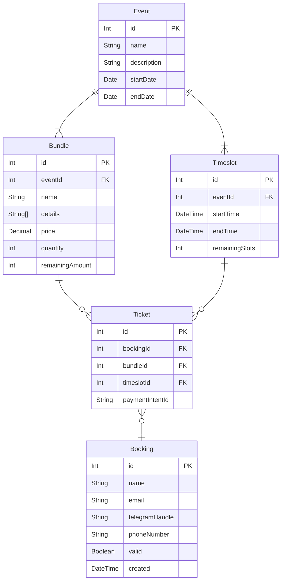
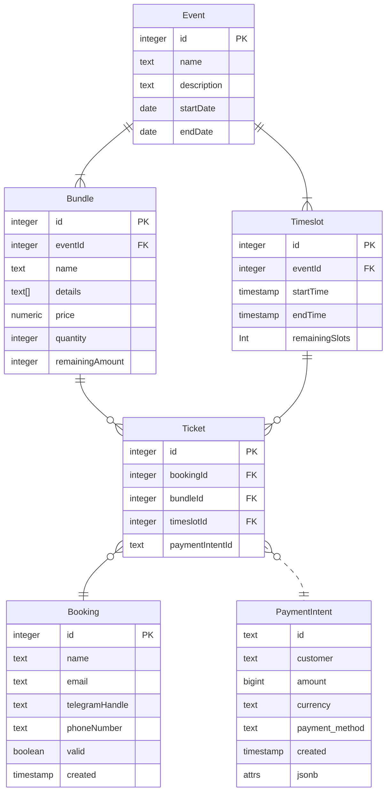

# Entity-Relationship Diagram

## Prisma Schema

## Database Schema

## Notes

- `Bundle.quantity`: number of slots this bundle occupies; number of people in this bundle
- `Bundle.remainingAmount`: number of bundles available
- `Ticket.paymentIntentId`: reference for Stripe PaymentIntent ID; not a foreign key
- `Booking.valid`: validity of the booking; Stripe webhook will check this; can be manually set to invalidate the booking
