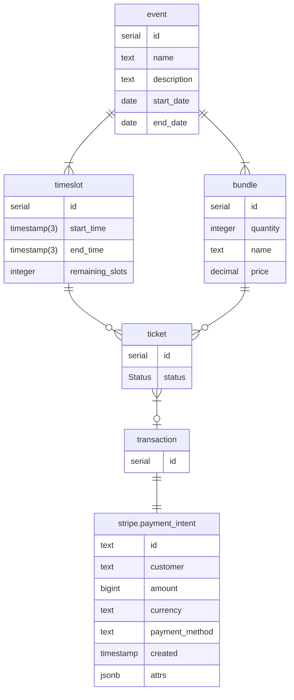

# Entity-Relationship Diagram

```mermaid
erDiagram
  event ||--|{ timeslot: ""
  event ||--|{ bundle: ""
  event {
    serial id
    text name
    text description
    date start_date
    date end_date
  }
  timeslot ||--o{ ticket: ""
  timeslot {
    serial id
    timestamp(3) start_time
    timestamp(3) end_time
    integer remaining_slots
   }
  bundle ||--o{ ticket: ""
  bundle {
    serial id
    integer quantity
    text name
    decimal price
  }
  ticket }|--o| transaction: ""
  ticket {
    serial id
    Status status
  }
  transaction ||--|| "stripe.payment_intent": ""
  transaction {
    serial id
  }
  "stripe.payment_intent" {
    text id
    text customer
    bigint amount
    text currency
    text payment_method
    timestamp created
    jsonb attrs
  }
```
