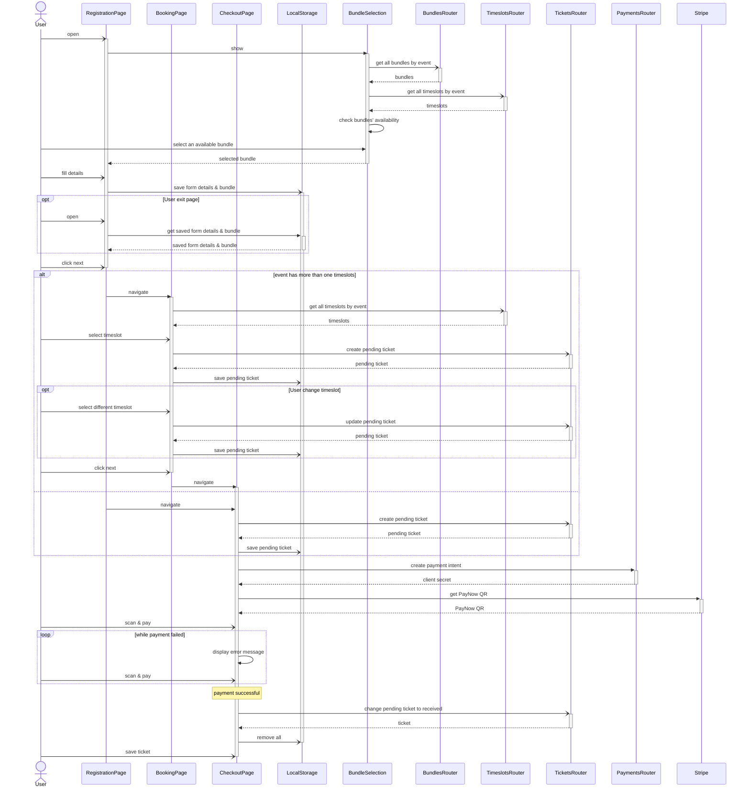

# Sequence Diagrams

## `RegisterForEvent` + `BookForEvent` + `PayForEvent`

```mermaid
sequenceDiagram
  actor User
  participant RegistrationPage
  participant BookingPage
  participant CheckoutPage

  User-)RegistrationPage: open
  activate RegistrationPage

  %% create participant BundleSelection
  participant LocalStorage

  RegistrationPage->>BundleSelection: show
  activate BundleSelection
  BundleSelection-)+BundlesRouter: get all bundles by event
  BundlesRouter-->>-BundleSelection: bundles
  BundleSelection-)+TimeslotsRouter: get all timeslots by event
  TimeslotsRouter-->>-BundleSelection: timeslots
  BundleSelection->>BundleSelection: check bundles' availability
  User->>BundleSelection: select an available bundle
  %% destroy BundleSelection
  BundleSelection-->>RegistrationPage: selected bundle
  deactivate BundleSelection

  User-)RegistrationPage: fill details
  RegistrationPage-)LocalStorage: save form details & bundle
  activate LocalStorage

  opt User exit page
    User-)RegistrationPage: open
    RegistrationPage->>+LocalStorage: get saved form details & bundle
    LocalStorage-->>-RegistrationPage: saved form details & bundle
  end

  User-)RegistrationPage: click next
  deactivate RegistrationPage

  alt event has more than one timeslots
    RegistrationPage->>BookingPage: navigate
    activate BookingPage
    BookingPage-)+TimeslotsRouter: get all timeslots by event
    TimeslotsRouter-->>-BookingPage: timeslots
    User-)BookingPage: select timeslot
    BookingPage-)+TicketsRouter: create pending ticket
    TicketsRouter-->>-BookingPage: pending ticket
    BookingPage-)LocalStorage: save pending ticket

    opt User change timeslot
      User-)BookingPage: select different timeslot
      BookingPage-)+TicketsRouter: update pending ticket
      TicketsRouter-->>-BookingPage: pending ticket
      BookingPage-)LocalStorage: save pending ticket
    end

    User-)BookingPage: click next
    deactivate BookingPage
    BookingPage->>CheckoutPage: navigate
    activate CheckoutPage
  else
    RegistrationPage->>CheckoutPage: navigate
    CheckoutPage-)+TicketsRouter: create pending ticket
    TicketsRouter-->>-CheckoutPage: pending ticket
    CheckoutPage-)LocalStorage: save pending ticket
  end

  CheckoutPage->>+PaymentsRouter: create payment intent
  PaymentsRouter-->>-CheckoutPage: client secret
  CheckoutPage->>+Stripe: get PayNow QR
  Stripe-->>-CheckoutPage: PayNow QR
  User-)CheckoutPage: scan & pay

  loop while payment failed
  CheckoutPage->>CheckoutPage: display error message
  User-)CheckoutPage: scan & pay
  end

  note over CheckoutPage: payment successful
  CheckoutPage-)+TicketsRouter: change pending ticket to received
  TicketsRouter-->>-CheckoutPage: ticket
  CheckoutPage-)LocalStorage: remove all
  deactivate LocalStorage
  User-)CheckoutPage: save ticket
  deactivate CheckoutPage
```
